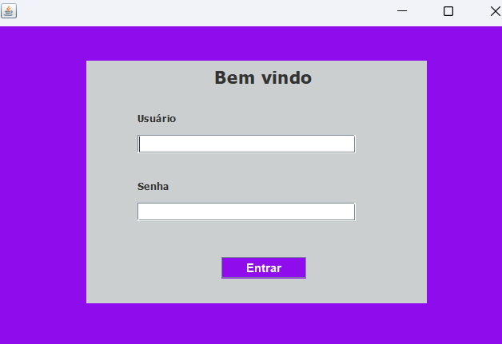

<h1 align="center"></h1>

## :camera: Demo

# Sistema de Cadastro
Neste Sistema CRUD Desktop utilizamos a JDK17, começando com a tela de login, usando criptografia e fazendo uma conexão com banco de dados interna o Dbeaver, com a tecnologia 
Jasper Studio criamos relatórios e finalizado usando o recurso de backup.

# Projeto Back-end

  - [x] JDK17
  - [x] JASPER_STUDIO
  - [x] JDBC_DBEAVER

